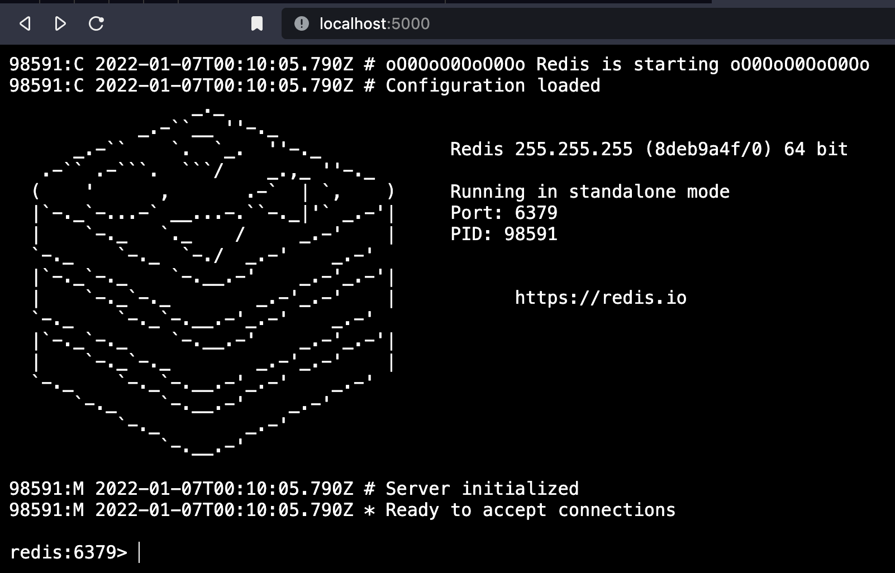

# redis-clinterwebz: a redis-cli in your browser



This project is a browser-based _redis-cli_-like interface to a real Redis server. It supports multiple sessions via key namespacing, and the script is embeddable so it can be shown in documentation pages.

## Getting started

1. Clone this repository
1. Change directory to the repository
1. (Recommneded) Use _virtualenv_: `virtualenv -p 3.9 venv; source venv/bin/activate`
1. Install the app: `pip install -e .`
1. Copy-paste this to your terminal: `export FLASK_APP=interwebz`
1. And lastly: `flask run`

You also need to have a local **`unstable`** (at least until v7.0 is out) Redis server configured with the included _redis/redis.conf_ file, i.e.:
```bash
cd redis
redis-server redis.conf
```

## TODO

* Embedded comments inline :)
* secrets/security/env
* Testing
* Deployment
* Request/IP throttling
* ...